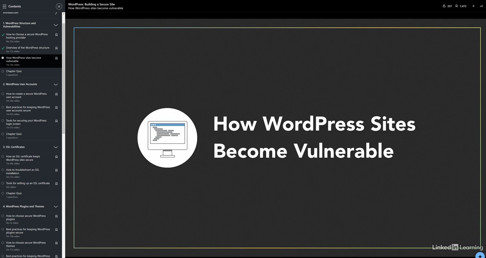

| INFO PROPERTY | VALUE                                         |
| ------------- | --------------------------------------------- |
| Program Name  | **TUTWRK: WordPress: Building a Secure Site** |
| Platform      | LinkedIn Learning                             |
| File Name     | README.md                                     |
| Date Created  | 07/25/24                                      |
| Date Modified | --                                            |
| Version       | 00.01.00                                      |
| Programmer    | **Eric Hepperle**                             |

### COURSE URL

- https://www.linkedin.com/learning/wordpress-building-a-secure-site

### GITHUB REPO

- https://github.com/codewizard13/ehw-tut-lil-wp--secure-site

### TECHNOLOGIES

  

**SCREENSHOT 1**:

## TAGS

`WordPress` `Website Security` `NO-Code`

## PURPOSE

Building a secure website is a required skill for anyone who develops websites. In this course, instructor Allie Nimmons walks you through how to build and launch a secure website with WordPress. Allie explains what to look for when you are shopping for a secure hosting provider for your website. She points out what practices are most important to protect your site from WordPress vulnerabilities, then goes into tools to secure WordPress user accounts and login screens. Allie covers all the basics about SSL certificates and discusses best practices for keeping WordPress plugins and themes secure. She tells you why spam comments pose a threat to WordPress sites and explains how to prevent and remove them. Allie steps through best practices for making backups, as well as tools for setting up a WordPress firewall. She concludes with steps you can take to make your ecommerce site and your WordPress files more secure.

### Course Info

## PLUGINS & DEPENDENCIES

- **Playwright**: enables reliable end-to-end testing for modern web apps
- **NodeJS**: Node.js lets developers use JavaScript to write command line tools and for server-side scripting

## USAGE

- N/A

## NOTES

Notes are located in [./notes/main.md](./notes/main.md)

## RESOURCES & REFERENCE

- https://www.freecodecamp.org/news/git-reverting-to-previous-commit-how-to-revert-to-last-commit/